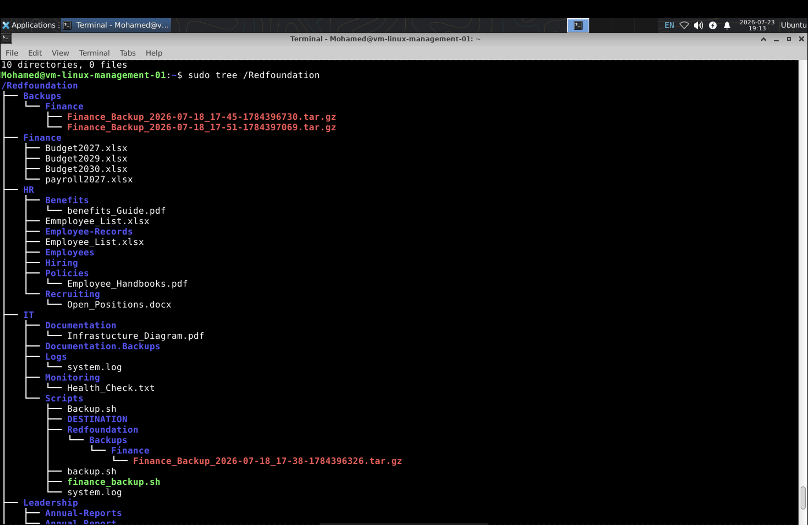
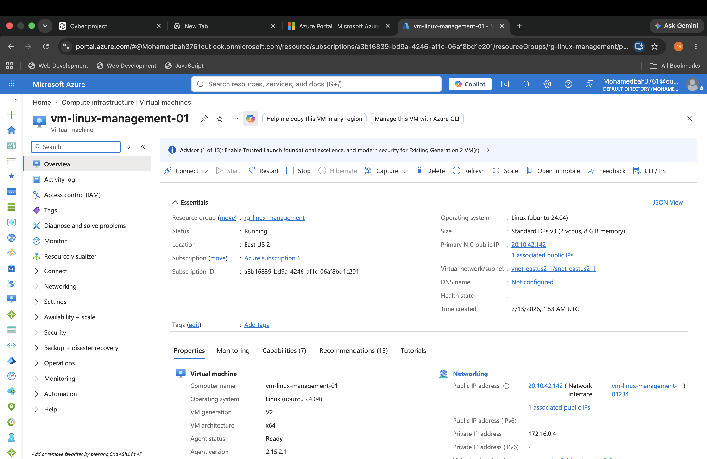
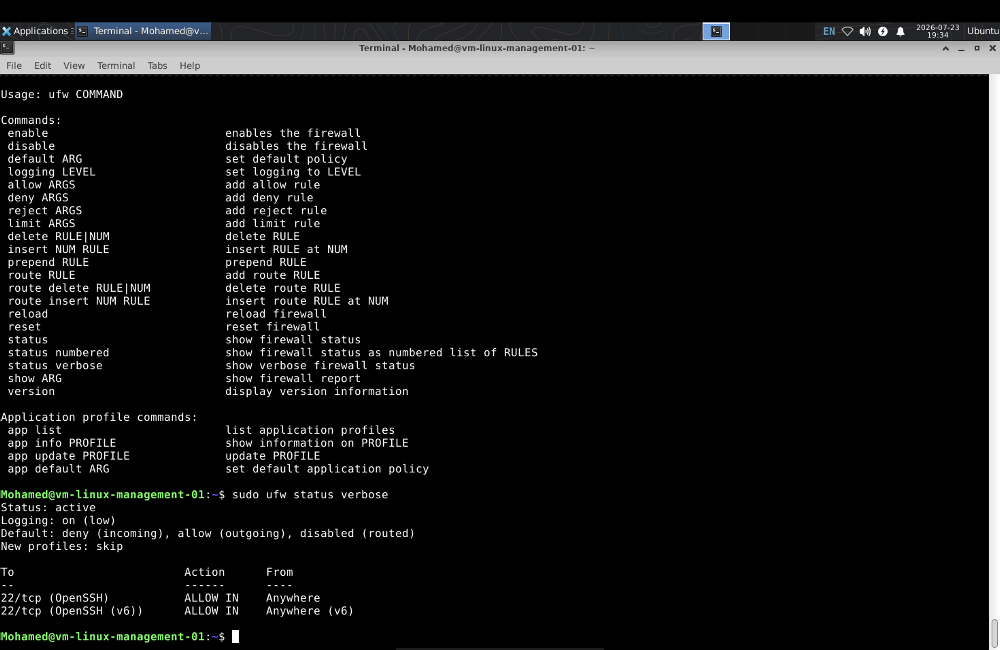
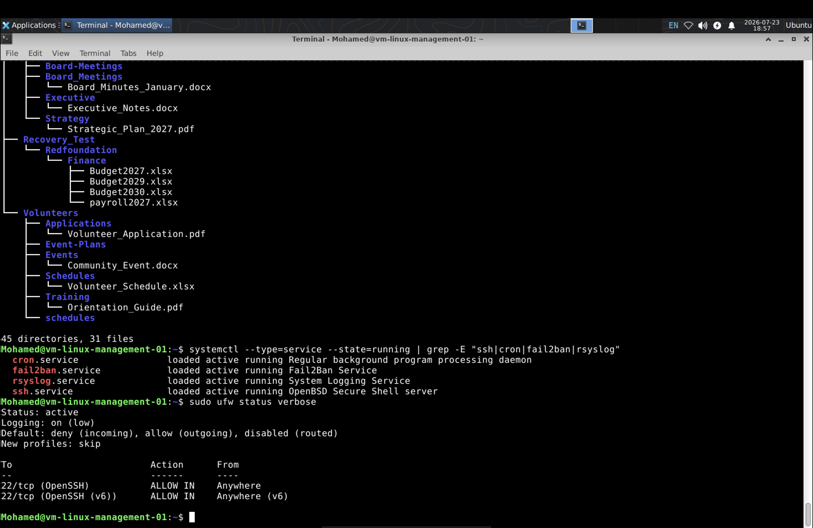
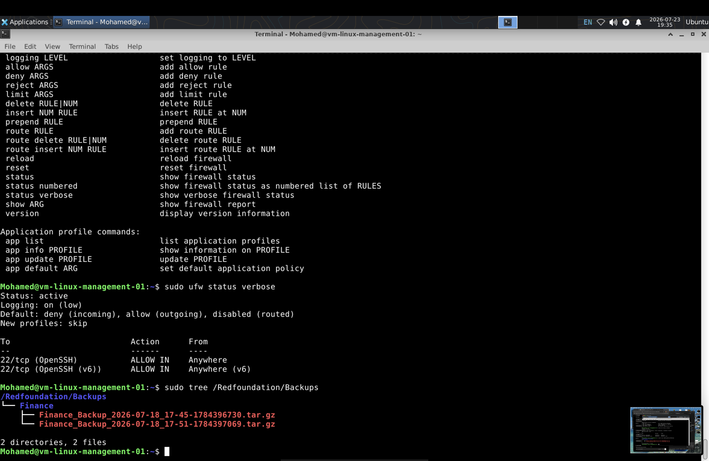
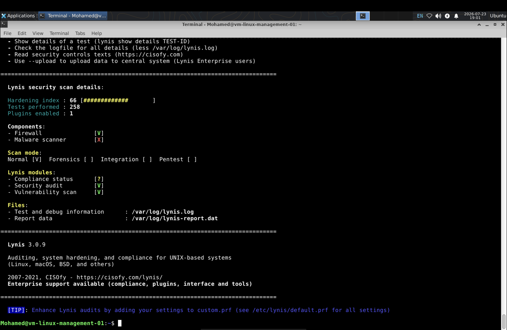

# Enterprise linux homelab

## Building and Securing an Enterprise Linux Environment on Microsoft Azure
---

# Project Architecture

The diagram below illustrates the overall design of the enterprise Linux environment, including Azure infrastructure, layered security, identity management, automation, backup, disaster recovery, and operational validation.

---

# Project Highlights

- ☁️ Deployed an Ubuntu Server in Microsoft Azure
- 👥 Implemented Linux user and group management with RBAC and ACLs
- 🔐 Secured the server using SSH key authentication, UFW, and Fail2Ban
- 🤖 Automated backups with Bash and Cron
- ♻️ Tested disaster recovery procedures
- 🛡️ Performed security auditing with Lynis and remediated findings
- 📚 Documented the project through 15 change-management style tickets
## Enterprise Structure

The project simulates a nonprofit organization with separate departments, shared resources, backups, and recovery locations. This structure was designed to reflect how an enterprise Linux environment might be organized.

This project documents the design and deployment of a production-style Linux environment hosted in Microsoft Azure. The goal was to simulate the responsibilities of a Linux Systems Administrator by building a secure, organized, and maintainable infrastructure from the ground up.

Throughout this project, I configured user and group management, role-based access control (RBAC), file permissions, SSH hardening, UFW firewall rules, Fail2Ban, automated backups, disaster recovery testing, and security auditing with Lynis. Everything is documented through individual tickets to reflect a real-world change management process.

This repository represents the complete lifecycle of planning, deploying, securing, maintaining, and validating an enterprise Linux environment.

---

# Azure Infrastructure

The environment is hosted on a Microsoft Azure Virtual Machine and secured with Azure networking controls before traffic reaches the Linux server.

---

# Security Configuration

Multiple layers of security were implemented to protect the server, including SSH hardening, UFW, and Fail2Ban.

## UFW Firewall

## Running Services

---

# Backup & Disaster Recovery

Automated backups were created and validated to support disaster recovery testing.

---

# Security Auditing

The system was audited using Lynis to identify vulnerabilities and improve the overall security posture through remediation.

---

# Skills Demonstrated

- Linux Administration
- Microsoft Azure
- Ubuntu Server
- Bash Scripting
- SSH Administration
- User & Group Management
- Role-Based Access Control (RBAC)
- Access Control Lists (ACLs)
- Firewall Management (UFW)
- Fail2Ban
- Cron Automation
- Backup & Disaster Recovery
- Security Hardening
- Vulnerability Assessment (Lynis)
- Enterprise Documentation

---

# Documentation

Detailed implementation steps for each phase of the project are available in the **Documentation** folder.

- Ticket 001 – Azure Infrastructure
- Ticket 002 – Linux User & Group Management
- Ticket 003 – File Permissions
- Ticket 004 - Access Control Lists (ACLs)
- Ticket 005 - Role-Based Access Control (RBAC)
- Ticket 006 - Enterprise Networking
- Ticket 007 - Bash Automation
- Ticket 008 - Backup Strategy
- Ticket 009 - System Monitoring 
- Ticket 010 - Troubleshootng
- Ticket 011 - Diseaster Recovery 
- Ticket 012 - Security Hardening
- Ticket 013 - Security Auditing 
- Ticket 014 - Enterprise Infrastructure Integration
- Ticket 015 – Production Readiness Validation

---

# Author

**Mohamed Bah**

Enterprise Linux Homelab Project

Built with Microsoft Azure, Ubuntu Server, and open-source Linux technologies.